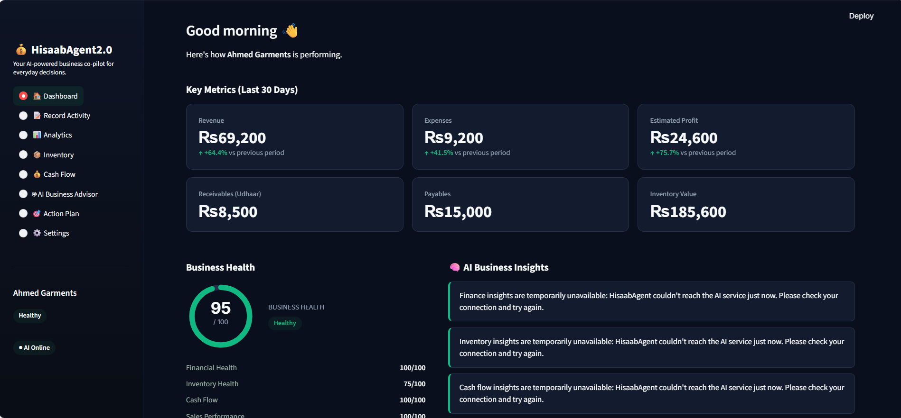

<div align="center">

# 💰 HisaabAgent2.0

### Just say what happened. AI handles the books.

An AI business co-pilot for micro-businesses, built for Pakistani shop owners. Understands English and Roman Urdu.




</div>

---

## ✨ Overview

Small business owners shouldn't have to fill in accounting forms. With HisaabAgent2.0, they simply describe their day:

> *"Aaj 20 shirts 1500 ki bechi aur 5000 supplier ko diye."*
> (Sold 20 shirts at 1,500 each today and paid 5,000 to the supplier.)

The app extracts the transaction, asks for confirmation, **calculates everything in Python**, saves it, and then uses AI to analyze the business and recommend what to do next.

Built for clothing shops, grocery stores, mobile accessory stalls, home-based sellers, and small wholesalers.

## 🚀 Features

| | |
|---|---|
| 📊 **Dashboard** | Revenue, profit, Business Health Score, and AI insights |
| 📝 **Record Activity** | Natural-language entry in English or Roman Urdu, with confirm-before-save |
| 📈 **Analytics** | Revenue and expense trends, top products, expense breakdown |
| 📦 **Inventory** | Stock levels, low-stock alerts, AI restocking advice |
| 💸 **Cash Flow** | Receivables (udhaar), supplier payables, cash flow charts |
| 🤖 **AI Advisor** | Ask questions about your business in plain language |
| 🎯 **Action Plan** | A prioritized daily to-do list with reasoning |
| ⚙️ **Settings** | Business profile, stock thresholds, demo data loader |

## 🧠 Design Principle: Python Calculates, AI Reasons

```
Human language → Gemini understands → Structured data →
Python validates + calculates → Database → AI analysis → Recommendations
```

- **Gemini** interprets messy language, extracts entities (product, quantity, price, customer, supplier), and writes insights from numbers that are already correct.
- **Python** performs every calculation: revenue, COGS, profit, margin, inventory value, cash flow, and the health score. Any total suggested by the model is discarded and recomputed.

LLMs can drift on arithmetic, and a ledger cannot tolerate that. Keeping math in deterministic Python means every number in the app is auditable and reproducible.

## 🤖 AI Agents

```
        Finance  ·  Inventory  ·  Cash Flow
                       ↓
               Business Advisor
                       ↓
                  Action Plan
```

Each agent receives a small, pre-computed context, never raw database access. Every prompt carries the same guardrail: state only what the data supports, otherwise say "not enough data."

## ⚡ Quick Start

**Requirements:** Python 3.10 or newer.

```bash
git clone https://github.com/AroonKumarMaheshwari-11/HisaabAgent2.0.git
cd HisaabAgent2.0

python -m venv venv
venv\Scripts\activate          # macOS/Linux: source venv/bin/activate
pip install -r requirements.txt
```

Get a free API key from [Google AI Studio](https://aistudio.google.com/apikey), then copy `.env.example` to `.env` and add your key:

```
GEMINI_API_KEY=your_key_here
```

```bash
streamlit run app.py
```

The app opens at `http://localhost:8501`. The SQLite database (`hisaabagent.db`) is created automatically.

**Want to see it populated right away?** Go to Settings → **Load Demo Business** to load "Ahmed Garments," a sample clothing shop with two weeks of data.

## ☁️ Deploy on Streamlit Community Cloud

1. Push the repository to GitHub (`.env` is gitignored and will not be uploaded).
2. Create a new app at [share.streamlit.io](https://share.streamlit.io) with `app.py` as the entry point.
3. In **Settings → Secrets**, add:

```toml
[gemini]
api_key = "your_actual_gemini_api_key"
```

No code changes are needed. The app reads the environment variable locally and Streamlit secrets in the cloud.

## 🎬 Demo Flow

1. Open the **Dashboard** to review revenue, profit, and the Health Score.
2. In **Record Activity**, enter: *"Aaj 20 shirts 1500 ki bechi, 5000 supplier ko diye aur Ali se 3000 lene hain."*
3. Click **Analyze Activity**, review the extraction, then **Confirm & Save**.
4. Return to the **Dashboard**. KPIs and the Health Score update instantly.
5. Open **Action Plan** to see AI-prioritized recommendations.

## 🗂️ Project Structure

```
app.py          # sidebar and page router
config.py       # model, currency, thresholds, colors
ai/             # Gemini client, prompts, agents
services/       # calculations, health score, analytics
database/       # SQLite schema and queries
views/          # one file per page
ui/             # theme CSS, components, charts
demo/           # Ahmed Garments sample data
utils/          # validators, formatters
```

## ⚠️ Known Limitations

- Single-business MVP with no multi-user authentication
- Currency is fixed to PKR
- Confirmed transactions cannot be edited, only added to
- The Action Plan is regenerated on demand and not cached

---

<sub>HisaabAgent2.0 provides AI-generated insights and is not a professional accountant or financial advisor. Please verify important financial decisions independently.</sub>